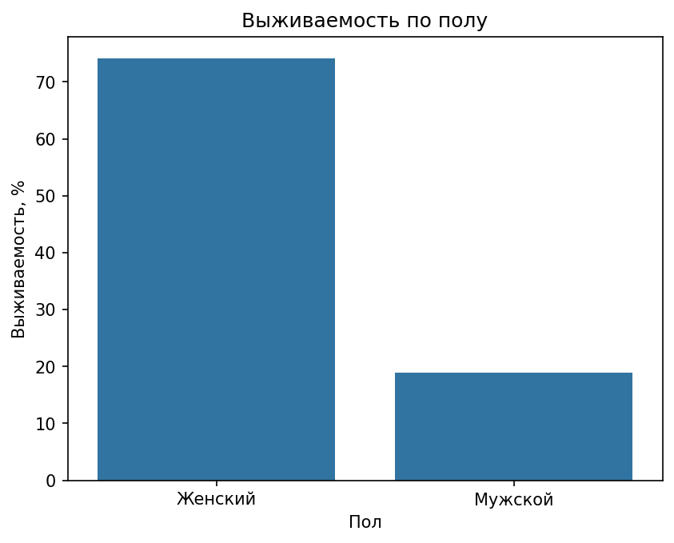
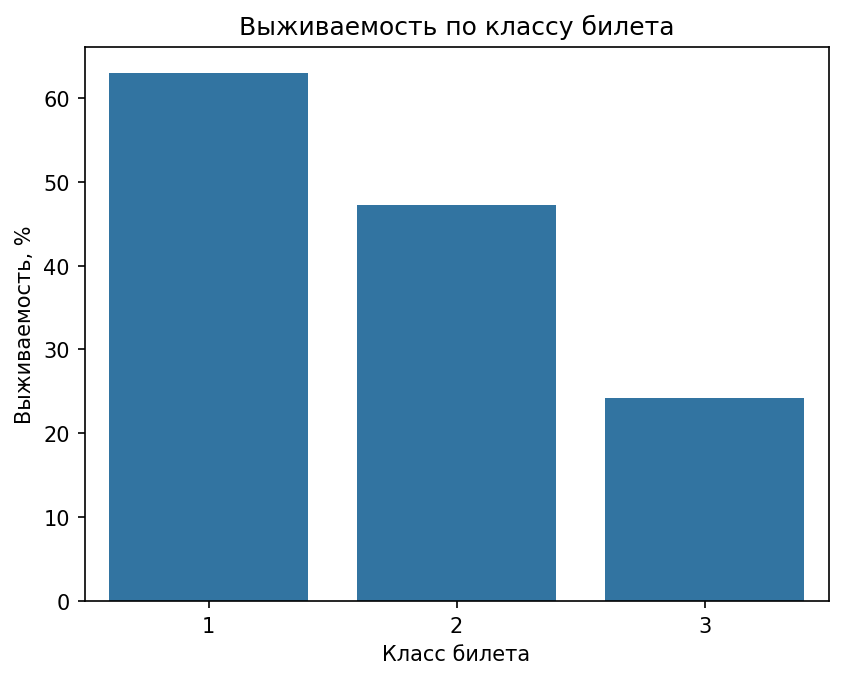
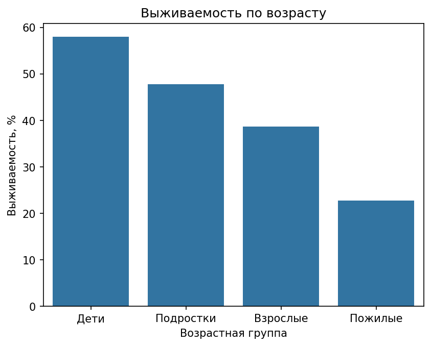
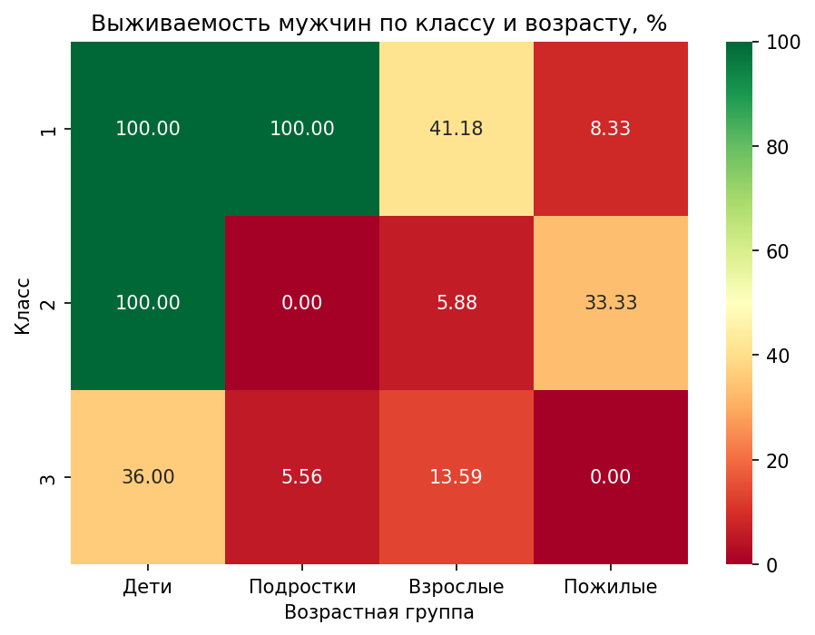
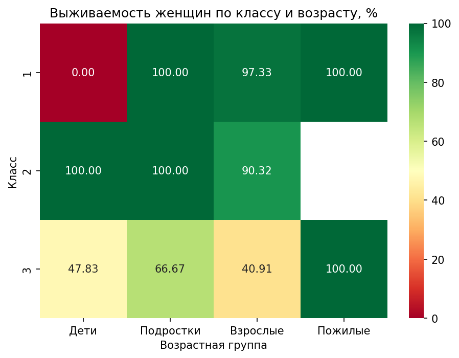

# Анализ пассажиров Титаника

Учебный pet-проект по разведочному анализу данных (EDA). В рамках проекта проверяется ряд гипотез о выживаемости пассажиров Титаника в зависимости от различных факторов.

Датасет взят с [Kaggle](https://www.kaggle.com/competitions/titanic/data?select=train.csv).

## Стек

- Python
- Pandas
- Matplotlib
- Seaborn

## Структура репозитория

```
titanic-eda/
├── data/
│   └── train.csv           # Датасет
├── images/                 # Графики
├── notebooks/
│   └── titanic_eda.ipynb   # Основной ноутбук с анализом
├── .gitignore
└── README.md
```

## Гипотезы и выводы

| Гипотеза                                     | Результат                                                                     |
| -------------------------------------------- | ----------------------------------------------------------------------------- |
| Женщины выживали чаще мужчин                 | ✅ Подтвердилась — 74.2% vs 18.9%                                             |
| Чем выше класс билета, тем выше выживаемость | ✅ Подтвердилась — 63.0% / 47.3% / 24.2% для 1/2/3 класса                     |
| Чем младше пассажир, тем выше шанс выжить    | ✅ Подтвердилась — дети 58.0%, пожилые 22.7%                                  |
| Чем старше пассажир, тем выше класс билета   | ✅ Подтвердилась — средний возраст в 1 классе 38.2 года, в 3 классе 25.1 года |
| Одиночки выживали чаще всех                  | ❌ Не подтвердилась — чаще выживали малые семьи (2-4 человека)                |
| Пассажиры из Саутгемптона выживали реже всех | ✅ Подтвердилась — 33.7% vs 55.4% из Шербура                                  |

### Ключевые наблюдения

**Класс билета** — главный фактор выживаемости, устойчивый вне зависимости от пола и возраста пассажира.

**Пол и возраст** — женщины и дети выживали значительно чаще, что соответствует правилу эвакуации "Сначала женщины и дети".

**Размер семьи и порт отправления** — наблюдаемые зависимости оказались ложными: в обоих случаях выживаемость объясняется концентрацией пассажиров 1-го класса, а не самими факторами.

## Графики

### Выживаемость по полу



### Выживаемость по классу билета



### Выживаемость по возрастной группе



### Сводный анализ: выживаемость по полу, классу, возрасту



